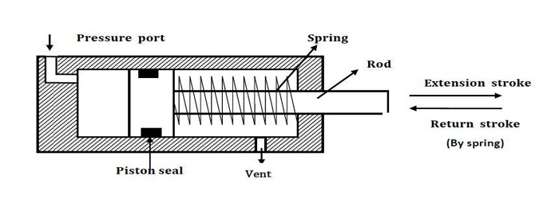

## Single Acting Cylinder
Pneumatic cylinders are devices for converting the air pressure into linear mechanical force and motion. Based on cylinder action we can classify the cylinders as single acting and double acting. Single acting cylinders have single air inlet line.

Single acting cylinder has one working port. Forward motion of the piston is obtained by supplying compressed air to working port. Return motion of piston is obtained by spring placed on the rod side of the cylinder. Schematic diagram of single acting cylinder is shown in figure. Single acting cylinders are used where force is required to be exerted only in one direction. Such as clamping, feeding, sorting, locking, ejecting, braking etc. Single acting cylinders require only about half the air volume consumed by a double acting cylinder for one operating cycle.
BS: 5785 1980 gives preferred sizes for the cylinder bore and rod diameter of metric cylinders. Most cylinder manufacturers have based their standard range of metric cylinders on these recommendations, offering two rod sizes for each cylinder bore. ISO 1219

(ISO 1219-1 gives the symbols for most commonly cylinders in industry)

## Direction control valves
Pneumatic systems like hydraulic system also require control valves to direct and regulate the flow of fluid from the compressor to the various devices like air actuators and air motors. In order to control the movement of air actuators, compressed air has to be regulated, controlled and reversed with a predetermined sequence. Pressure and flow rates of the compressed air to be controlled to obtain the desired level of force and speed of air actuators. The function of directional control valve is to control the direction of flow in the pneumatic circuit. DCVs are used to start, stop and regulate the direction of air flow and to help in the distribution of air in the required line.

The form of control energy will be dictated by the valve's mode of actuation and may be manual, mechanical, electrical hydraulic or pneumatic. The different classification scheme of the pneumatic direction control valve are based on construction, number of ports and method of actuation.

Valves are represented by symbols because actual construction is quite complex. A symbol specifies function of the valve, method of actuation, no of ports and ways. Pneumatic symbols have been standardised in ISO 1219-1:2006. (Fluid power systems and components Graphic symbols and circuit diagram). Another standard ISO 1219-2:1995 establishes the rules for drawing diagrams of fluid power systems using symbols from ISO 1219-1. Port designations are described in ISO 5599.

## Hand operated 3/2 DCV
The cross sectional views of 3/2 DCV (normally closed) based on spool design is shown below. When the valve is not actuated, port 2 and 3 are connected and port 1 is blocked. When the valve is actuated then port 2 and 1 are connected and port 3 is blocked.

Normally closed 3/2 way direction control valve

## Pneumatically actuated 3/2 DCV
The cross sectional views of pneumatically actuated NC type 3/2 DCV in normal position and actuated positions are shown in the figure.

In normal position, the working port (2) is closed to the pressure port (1) and open to the exhaust port (3). When the compressed air is applied through the pilot port (12), the spool is moved against the spring. In the actuated position, the working port (2) is open to the pressure port(1) and closed to the exhaust port(3). Thus, the application of the compressed air to the port 12 causes the pressure port (1) to be connected to the working port (2).

## Piston Force
The piston force exerted by a working element is depend on air pressure, the cylinder diameter and frictional resistance of the sealing components.

## For Single acting cylinder
* F = A. P - Ffriction- Fspring
* Fr = Frictional Force
* Fs = Spring Force
* A = Cylinder cross sectional area in ^2
* P= pressure of air (psi)

Weigh your load, including any base or supports, and determine the opposing force FL needed to support it. Select the appropriate multiplier from the table below based on the angle of inclination of the load.
	

FL = A * Load

## Piston Speed
The piston speed in pneumatic cylinder is depends on the counter force, the pipe length, the cross-sectional area of the valve port and flow rate and also on the end-position cushioning.
Increase the force as necessary to achieve the desired speed.
Simply multiply Force from step (1) above by S from the table below.

FF = FL* S
Calculate the cylinder area using
FF = A. P
Read cylinder bore size from table.

Example: The load is 400 pounds. It will be moved up an incline of 50 degree. The load must move at 8 inches per second. What cylinder bore size is required?
* FL = A x (weight of load) = .77 x 400 = 308
* FF = FL x S = 308 x 1.5 = 462
* A = FF /P = 462 = 5.8
Bore size required is 3 inches.

## Pneumatic Circuit
Direct control of a single acting cylinder
Pneumatic cylinders can be directly controlled by actuation of final directional control valve. These valves can be controlled manually or electrically. This circuit can be used for small cylinders as well as cylinders which operates at low speeds where the flow rate requirements are less. When the directional control valve is actuated by push button, the valve switches over to the open position, communicating working source to the cylinder volume. This results in the forward motion of the piston. When the push button is released, the reset spring of the valve restores the valve to the initial position [closed]. The cylinder space is connected to exhaust port there by piston retracts either due to spring or supply pressure applied from the other port.

## Indirect control of a single acting cylinder
This type of circuit is suitable for large single cylinders as well as cylinders operating at high speeds. The final pilot control valve is actuated by normally closed 3/2 push button operated valve. The final control valves handle large quantity of air. When the push button is pressed, 3/2 normally closed valve generate a pilot signal 12 which controls the final valve thereby connecting the working medium to piston side of the cylinder so as to advance the cylinder. When the push button is released, pilot air from final valve is vented to atmosphere through 3/2 NC DCV. The signal pressure required can be around 1-1.5 bar. The working pressure passing through the final control valve depends on the force requirement which will be around 4-6 bar. Indirect control as permits processing of input signals. Single piloted valves are rarely used in applications where the piston has to retract immediately on taking out the set pilot signal.

